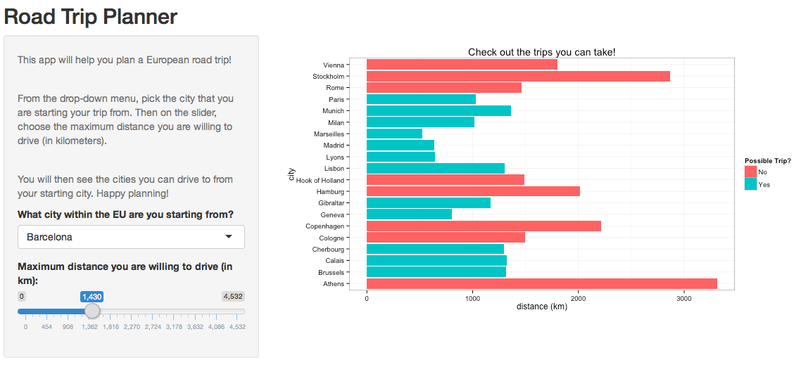

<style>
    .reveal h1 {
        word-wrap: normal;
        -webkit-hyphens: none;
    }
    .small-code pre code {
        font-size: 1em;
    }
    .reveal h3 {
        text-shadow: 2px 2px #0000ff;
    }
</style>

European Road Trip Planner
========================================================
author: Sonia Lebofsky
transition: rotate


Summary
========================================================
transition: linear
font-family: helvetica

This shiny app can be used to help you plan your European road trip!

Here's how it works:

* From the provided list of EU cities, you find the one you are starting your trip from. 

* Use the slider to tell the app what is the maximum distance you are willing to drive (in kilometers).

* The app will then show you all the possible trips starting from the city you chose, but then highlights the cities you can reach given your max driving distance.


The Dataset
========================================================
transition: linear
font-family: helvetica

The app uses the **eurodist** dataset from the R datasets package.

The dataset consists of the road distances (in kms) between 21 cities in Europe. The data is from a table in
*The Cambridge Encyclopaedia*.

The data is given as `dist` objects, which is easier to manipulate when converted into a matrix format.

The next slide shows a preview of the actual data.

========================================================
title: false
transition: linear
class: small-code
type: sub-section


```r
library(datasets)
data("eurodist")
head(as.matrix(eurodist))
```

```
          Athens Barcelona Brussels Calais Cherbourg Cologne Copenhagen
Athens         0      3313     2963   3175      3339    2762       3276
Barcelona   3313         0     1318   1326      1294    1498       2218
Brussels    2963      1318        0    204       583     206        966
Calais      3175      1326      204      0       460     409       1136
Cherbourg   3339      1294      583    460         0     785       1545
Cologne     2762      1498      206    409       785       0        760
          Geneva Gibraltar Hamburg Hook of Holland Lisbon Lyons Madrid
Athens      2610      4485    2977            3030   4532  2753   3949
Barcelona    803      1172    2018            1490   1305   645    636
Brussels     677      2256     597             172   2084   690   1558
Calais       747      2224     714             330   2052   739   1550
Cherbourg    853      2047    1115             731   1827   789   1347
Cologne     1662      2436     460             269   2290   714   1764
          Marseilles Milan Munich Paris Rome Stockholm Vienna
Athens          2865  2282   2179  3000  817      3927   1991
Barcelona        521  1014   1365  1033 1460      2868   1802
Brussels        1011   925    747   285 1511      1616   1175
Calais          1059  1077    977   280 1662      1786   1381
Cherbourg       1101  1209   1160   340 1794      2196   1588
Cologne         1035   911    583   465 1497      1403    937
```

fifth slide
========================================================
title: false
transition: zoom
transition-speed: slow
font-family: helvetica

Here's a screen-shot of the app in action:


